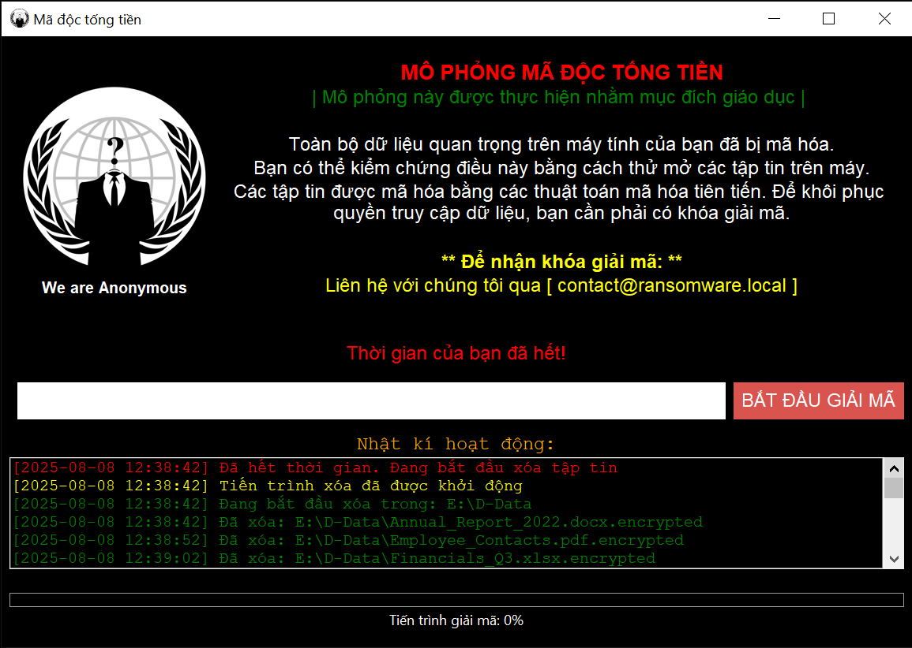
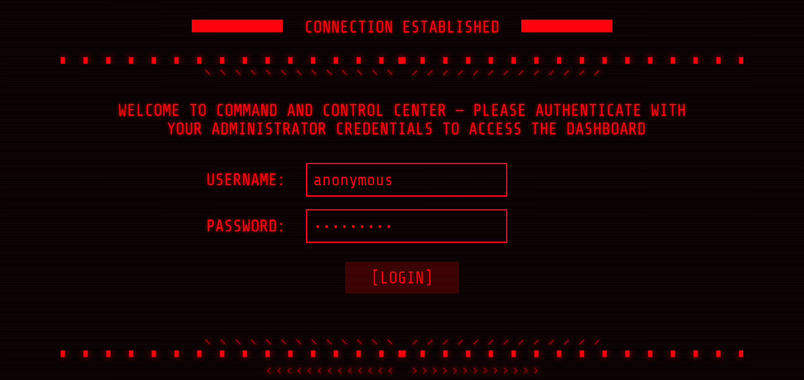
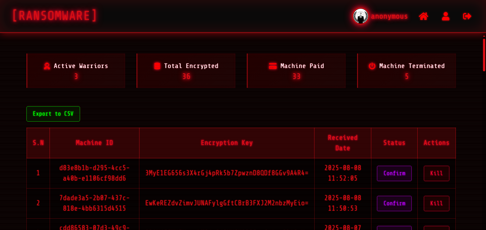
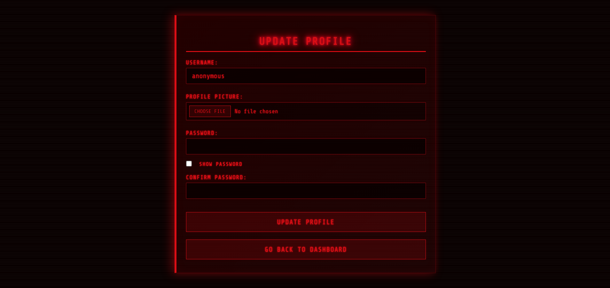

<h1 align="center">Ransomware Simulator</h1> 

<div align="center">

    

  <p><em>Giao diện Ransomware Simulator (client)</em></p>

  <p>
    <a href="#tong-quan">Tổng Quan</a> •
    <a href="#huong-dan">Hướng Dẫn</a> •
    <a href="#screenshots">Screenshots</a> •
    <a href="#mien-tru-trach-nhiem">Miễn Trừ Trách Nhiệm</a> •
    <a href="#loi-cam-on">Lời Cảm Ơn</a>
  </p>

  [](https://vimeo.com/1108790702)

</div>


<h2 id="tong-quan">📖 Tổng Quan</h2>

Dự án này mô phỏng cách thức hoạt động của ransomware trong môi trường thực tế, tái hiện các kỹ thuật quan trọng thường được triển khai trong các cuộc tấn công ransomware. Các kỹ thuật này bao gồm:

 - Mã hóa và giải mã tệp 
 - Quản lý khóa mã hóa
 - Giao tiếp mạng với máy chủ Command & Control (C2)

Dự án được xây dựng nhằm mục đích nghiên cứu và giáo dục, giúp nâng cao kỹ năng phân tích, phát hiện và ứng phó trước các mối đe dọa về ransomware.


<h2 id="huong-dan">🖥️ Hướng Dẫn (Windows)</h2>

1. Tải và cài đặt [XAMPP](https://www.apachefriends.org/download.html).

2. Truy cập thư mục `C:\xampp\htdocs` → Tạo thư mục mới tên `ransomware` → Đặt các thư mục và tệp đã tải về từ kho lưu trữ vào trong thư mục ransomware vừa tạo, với cấu trúc như sau:

      ```
      📂 C:\xampp\htdocs\ransomware
      ├── 📂 assets
      ├── 📂 img
      ├── 📂 includes
      ├── 📂 public
      ├── 📂 time
      ├── 📂 uploads
      └── 🐍 ransomware.py
      ```

3. Mở **XAMPP Control Panel**, nhấn nút **Start** để khởi chạy dịch vụ ***Apache*** và ***MySQL***.

4. Mở trình duyệt web và *lần lượt* truy cập vào các đường dẫn sau:

    - [http://localhost/phpmyadmin](http://localhost/phpmyadmin): Chọn tab **Databases** → Nhập vào ô *Database Name* là ***ransomware*** → Nhấn vào nút **Create** để tạo database.
    - [http://localhost/ransomware/includes/migrate.php](http://localhost/ransomware/includes/migrate.php): Khởi chạy tệp `migrate.php`.
    - [http://localhost/ransomware/public/register.php](http://localhost/ransomware/public/register.php): Đăng ký một tài khoản mới.
    - [http://localhost/ransomware/public/login.php](http://localhost/ransomware/public/login.php): Đăng nhập vào dashboard.

5. Mở **Command Prompt (CMD)** và chạy lệnh:
    ```sh
    python ransomware.py
    ```


<h2 id="screenshots">📷 Screenshots</h2>

<p align="center">
  
  <br>
  
  
</p>
<p align="center"><em>Giao diện máy chủ Command &amp; Control</em></p>


<h2 id="mien-tru-trach-nhiem">⚠️ Miễn Trừ Trách Nhiệm</h2>

Dự án này chỉ dành cho mục đích giáo dục và kiểm thử an toàn thông tin một cách hợp pháp. Nghiêm cấm mọi hành vi sử dụng để gây hại, đe dọa hoặc tấn công vào các hệ thống và môi trường thực tế. Nhà phát triển và những người đóng góp sẽ không chịu bất kỳ trách nhiệm nào đối với mọi hậu quả hoặc thiệt hại phát sinh từ việc sử dụng sai mục đích.

Việc tải xuống và sử dụng dự án này đồng nghĩa với việc bạn đã đọc, hiểu và chấp nhận các điều khoản trên. Nếu vi phạm, bạn phải tự chịu toàn bộ trách nhiệm pháp lý.


<h2 id="loi-cam-on">💎 Lời Cảm Ơn</h2>

Cảm ơn **Mr. Hex** đã chia sẻ ý tưởng và mã nguồn ban đầu.